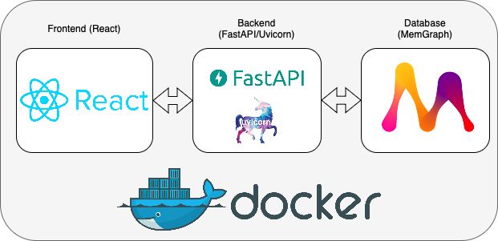
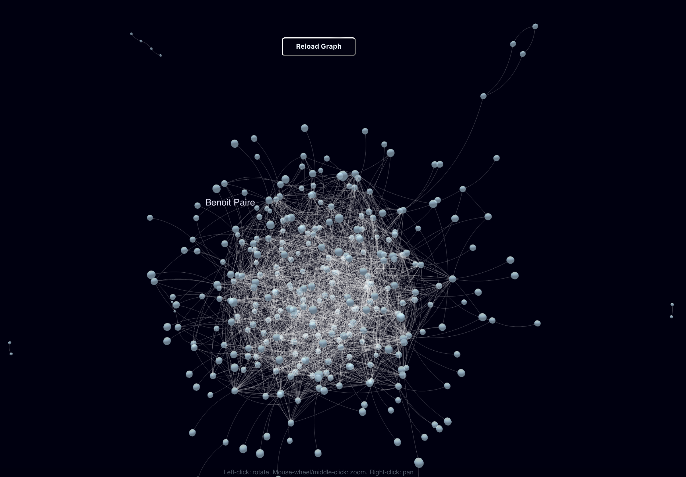

# Memgraph + FastAPI + React (React-Force-Graph) + Docker
This is a simple example of how to use [Memgraph](https://memgraph.com/) with [FastAPI](https://fastapi.tiangolo.com/) and [React](https://reactjs.org/) => [React-Force-Graph](https://github.com/vasturiano/react-force-graph) in a Docker environment.

### Schema

## Requirements
- [Docker](https://docs.docker.com/get-docker/)

## Usage
1. Clone this repository
2. Run `docker-compose up` in the root directory
3. Open `http://localhost:3000/` in your browser
4. Graph can be also explored in memgraph lab at `http://localhost:3001/`

## How it works
Data is loaded from db/import/*.csv files into Memgraph via load.sh script. Feel free to modify the data in those files and reload the data by running `docker-compose up` again.

### Data
Currently data consists of atp matches from 2023. Data was downloaded from https://github.com/JeffSackmann/tennis_atp.

## Screenshots
React-Force-Graph (port 3000)

Memgraph Lab (port 3001)

## Acknowledgements
- [Memgraph](https://memgraph.com/)
- [FastAPI](https://fastapi.tiangolo.com/)
- [React](https://reactjs.org/)
- [React-Force-Graph](https://github.com/vasturiano/react-force-graph)
- [Docker](https://www.docker.com/)
- [Uvicorn](https://www.uvicorn.org/)

## Contributing
If you have any suggestions, ideas or you want to contribute please contact me or just make a pull request.
